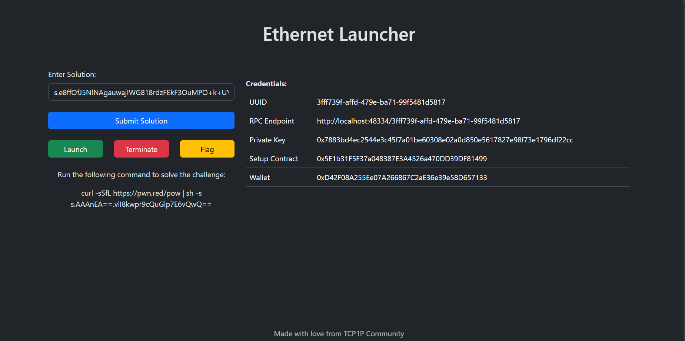

# Paradigmctf BlockChain Infra Extended

This repository contains the setup from Paradigm CTF blockchain challenges based on the original repository [paradigmxyz](https://github.com/paradigmxyz/paradigm-ctf-infrastructure/tree/master). We've introduced new features, including a web interface and additional challenge setup.

## Build Docker Images

To build the required Docker images, navigate to the `images` directory and run the provided build script:

```sh
cd ./images
./build.sh
```

## Run Challenges

To run the challenges, use Docker Compose. Navigate to the `challenge` directory and execute the following command:

```sh
cd ./challenge
docker-compose up --build
```

You can check your localhost at http://127.0.0.1:48334/ to ensure that the challenges are running. Please note that the backend may require more time to set up, so you need to wait for the backend to start.


